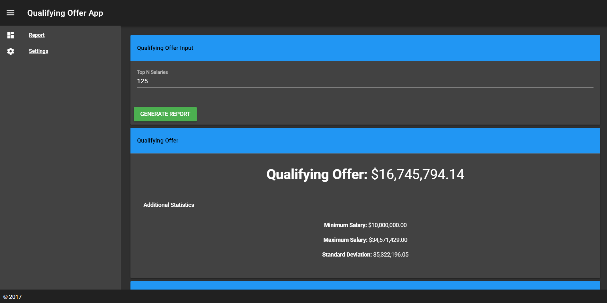
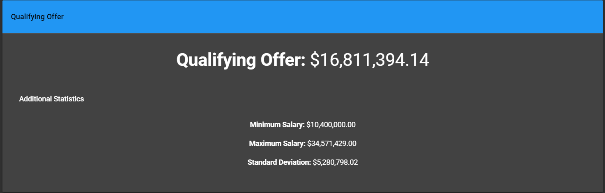
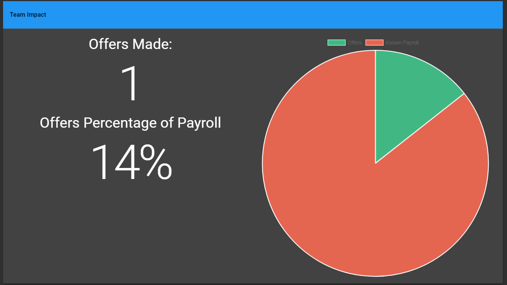
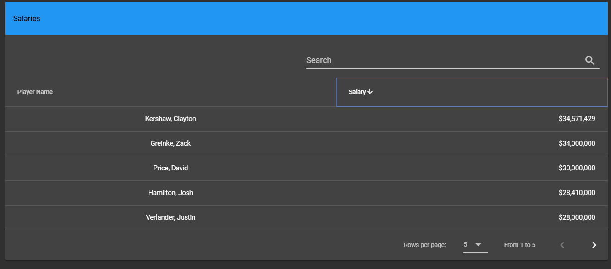

= Qualifying Offer Calculation App

Application for generating Report for what a Qualifying Offer will be based on the top 125 salaries(configurable).

== Instructions

https://qo-app.herokuapp.com/[Live Demo]

1. Application opens up at Report page. Users can input the following information:
* Top N Salaries: Represents number of salaries to factor in for offer(default: 125)
* Known Payroll: Payroll for team calculated in millions(default: 100)
* Offers: Number of offers team is sending out to it's free agents(default: 1) 
2. Click `Generate Report` button to get the Qualifying Offer Report. Once the report loads you can scroll down and see the following information:

Above you can see the qualifying offer and related meta data. 

Above you can see measurements of team impact based on report input. 

Above you can search the salaries that were factored into the report.

Note: If you'd like to get data from a different REST endpoint click on Settings dashboard 

== Technology Used

Main technology used is Java for the backend(REST), Javascript for the Frontend with https://vuejs.org/[Vue.js] and https://vuetifyjs.com/[Vuetify] as my Javascript and CSS Framworks, https://jsoup.org/[Jsoup] for scraping, Maven for build and an assortment of other FOSS products for doing utility functions.  

== REST

REST Resource that scrapes given URL in web.xml file and returns a report of with the Qualifying Offer plus meta data. 

== Web

GUI for querying the REST Endpoint above

== Build 

To build this project from scratch you'll need to have the following:

* maven
* Ability to hit maven central and default npm repository

=== Developer Instructions

. Run `mvn clean install` from the root directory
. Once the build is done you'll have a working application that runs in Jetty application container
. `cd` into qo-app-dist/target/jetty-distribution-${jetty.version} 
. Run java -jar start.jar or ./bin/jetty.sh start
. You should now be able to view the application at http://localhost:8080/qo-app
. Follow instruction above to generate a report

=== Debug

. You can run the npm application locally using `npm run dev` once you've installed all the dependencies
. You can run the REST application locally using `mvn jetty:run`
. See the web.xml to change where the REST endpoint scrapes it's data from 

*Note: Be sure to run npm and jetty on different ports. `mvn jetty:run -Djetty.http.port=<port number>` will allow you to change ports. 

== Heroku Instructions

In order to deploy run this command from the qo-salary-rest:

https://devcenter.heroku.com/articles/deploying-java-applications-with-the-heroku-maven-plugin[Heroku Maven Deploy] 
----
mvn clean install heroku:deploy-war
----
